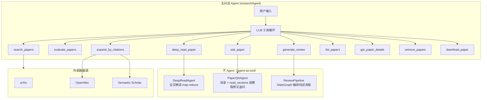
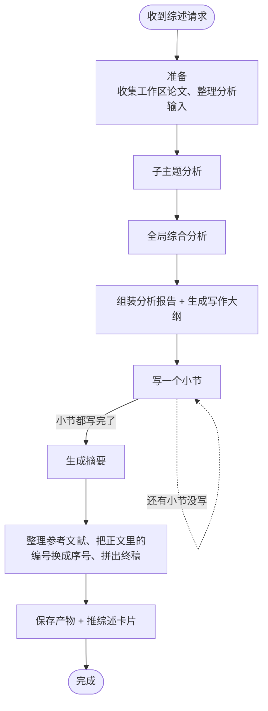

<div align="center">

# 知枢Paper-Agent · 个性化科研工作台

**输入一个研究主题 → 收获论文调研、阅读以及综述撰写的全周期信息**

[](https://www.python.org/)
[](https://fastapi.tiangolo.com/)
[](https://vuejs.org/)
[](https://docs.astral.sh/uv/)

</div>

---


## 🆕 3.0 版本更新

Paper-Agent 3.0 是相对旧版<a href="https://github.com/GreatZack">@GreatZack</a>项目的一次**全新重写**。它保留了旧版「检索 → 阅读 → 分析 → 写作」的相关思路，但在Agent化实现上做了全面升级：

- **前端**改为 Vue 3 + TypeScript + Vite，交互更现代、响应更快；
- **包管理**统一使用 `uv`，一条命令即可完成 Python 依赖安装；
- **论文来源**从单一 arXiv 扩展到 arXiv、OpenAlex、Semantic Scholar 三源检索；
- **会话持久化**改用 SQLite + 文件系统，浏览器刷新后历史线程不丢失；
- **实时进度**基于 SSE 推送到工作台，从检索到写作每一步都可观察。


---

## 👀 界面概览


<p align="center">
  
  <br>
  <em>输入研究主题，实时追踪检索论文、精读论文、生成综述等各环节进度（综述内部的分析、大纲、逐节写作以同一张卡片的实时状态文字呈现）</em>
</p>

<p align="center">
 
  <br>
  <em>在浏览器中可视化配置模型 Provider 与 Agent 档位，一键测试连通性</em>
</p>

---

## 🎯 为什么是 Paper-Agent？

做学术调研时，你一定经历过这些：

| 场景 | 传统方式 | **Paper-Agent** |
|------|---------|-----------------|
| 初步了解陌生研究方向 | 手动搜索多个来源，逐个打开论文判断相关度，**耗时费力** | 从 arXiv / OpenAlex / Semantic Scholar 自动检索，按主题和约束去重、筛选、整理 |
| 论文阅读与资料积累 | 读完一篇记一篇笔记，资料散落在各处，**容易丢失和重复** | 先读摘要判断相关性，再按条件下载全文、解析、切分，逐块精读并把全文与笔记留在本地 |
| 撰写领域综述 | 边读边写，反复调整结构，**常常写到一半推倒重来** | 先从论文整体分析、再做全局综合，据此生成结构化大纲，然后逐节按证据写作 |
| 管理长流程任务 | 每跑一步都担心进度、状态和重启后丢失，**不敢中途停下** | 会话、运行状态、阶段产物和实时进度都在工作台可见；刷新后历史与实时流可接回，进程中断的任务会被标记为「已中断」，可基于工作区已保存的产物继续下一轮调研 |
| 控制模型成本 | 全程用一个模型档位，**不清楚每个环节花了多少 token** | 精读、追问、综述等子 Agent 的 token 用量会累加到对应工具卡片；主对话按轮次上报，多轮对话下看到的是最近一轮的用量 |

> **Paper-Agent 是一个完整的 AI 研究助理——它找得到论文、读得懂全文、理得清脉络、写得出综述。**

---

## ✨ 核心特性

| | 特性 | 一句话说明 |
|--|------|-----------|
| 🔍 | **多来源论文检索** | 内置 arXiv、OpenAlex、Semantic Scholar 连接器，统一为 `PaperDocument`，按年份、来源、数量和排除词筛选并去重；按研究主题用概念组检索，用户给出一篇已知论文的完整标题时由助手自动改走标题检索，不必拆成布尔关键词。多源结果用 RRF（排名融合）排序——每篇论文按它在各源里给出的名次累计得分，被多个源同时命中、且名次靠前的排在前面 |
| 📖 | **从摘要到全文的渐进式阅读** | 先读摘要判断相关性，满足条件的论文走下载 → PDF 转 Markdown（公式截图转成 LaTeX、表格截图重排成表头正确的 Markdown 表）→ 分块 → 逐块精读；同时把论文插图连着图注和正文里讲到它的段落一起交给模型读一遍，让它写清每张图画了什么；最后汇总成报告。需要再精读一遍时，只清掉旧报告、复用已经切好的正文片段重新阅读，不必从工作区删文再检索。全文下载或转换失败时自动降级为「基于摘要的精读」，并把失败原因告知用户 |
| 🧩 | **本机论文长期记忆** | 一篇论文完成全文分片和精读后，报告和分片留在本机。之后任意会话再检索到同一篇（按 DOI / arXiv / 标题认），会自动召回已有报告和分片，不必重新精读；只有摘要的降级报告不进入这份记忆 |
| 🧠 | **上下文预算与自动压缩** | 对话历史不再按固定轮数截断，而是按「模型窗口 × 0.8」的 token 预算管理：超预算先免费归档旧工具结果（附 `get_history` 取回工具），仍不够再把最老的整轮经一次 LLM 调用压成要点摘要（带缓存、不落库）；问答子 Agent 同样改为「全文目录 + read_sections 按需取原文」，长论文中间内容不再被截断弄丢 |
| 🔬 | **分层研究分析** | `AnalyseAgent` 先把工作区全部论文的结构化摘要做一次整体分析，再做一次全局综合，形成研究现状、共识、争议、空白、时间演化与展望等结构化内容 |
| ✍️ | **证据约束下的综述写作** | `WritingOutlineAgent` 生成大纲与证据映射，`WritingAgent` 逐节写作、证据不足时检索补充、完成后审查并限次修改 |
| 📡 | **实时会话工作台** | SSE 实时推送检索、阅读、分析、大纲与逐节写作进度，SQLite + 文件系统持久化，刷新后历史可恢复；长对话打开时先显示最近几轮，避免一次画出全部历史 |
| 🎛️ | **可视化模型配置** | 在浏览器中管理 Provider 协议、API 地址、密钥与各 Agent 档位，一键测试连通性，保存即生效 |

---

## 🔧 架构



> 主对话共注册 10 个工具（上图全部列出）。引文扩展（`expand_by_citations`）由 OpenAlex 与 Semantic Scholar 承担：arXiv 的接口本身不提供引文数据，所以它不参与回答，但 arXiv 来源的论文只要带编号（arXiv 编号或 DOI）一样可以扩展。

### 编排范式：什么用流程图、什么用手写循环

项目里有两种编排方式，分工是明确的：

| 流程长什么样 | 用什么 | 为什么 |
|------|------|------|
| 阶段能提前枚举出来（综述：分析 → 大纲 → 逐节写作 → 摘要 → 参考文献 → 终稿） | LangGraph `StateGraph` | 控制流一眼看得全，而且阶段之间天然就是"这一步做完了"的边界，正好用来存检查点 |
| 需要模型每轮自由决定下一步（主对话：想检索就检索、想精读就精读、够了就直接回答） | 手写 `while` 循环 | 循环里要插三件框架不让你顺手插的事：每轮开头的取消检查、推理模型 thinking 块的协议回传、同一轮多个工具的并发控制 |

所以"主对话"和"综述"看起来风格不一样，不是没统一，是两件事的形状本来就不一样。

### 综述流水线（StateGraph）



**步骤级断点续跑**：每做完一个阶段，图的状态会写进会话目录下的 `checkpoints.db`（随会话一起删除）。所以综述跑到一半进程挂了、或者用户中途点了停止，可以从最后一个做完的阶段接着写——已经写好的小节不用重写，只有崩溃时正在写的那一节要重做。也可以在失败或已停止的卡片上点"继续"。

两个实现细节：

- **写作子图明确不写检查点。** 小节写作本身也是一张图，它嵌套在综述图里运行，默认会被外层的检查点配置带上、把每节的内部中间状态也存一遍——实测能占整个检查点库的四分之三，而外层是一节一个检查点，这些中间状态没有任何恢复价值。所以内层图调用时显式关掉了检查点。
- 检查点库的大小随综述规模增长：每完成一节就落一次快照，快照里含当时已写的全部小节。一份 12 节、单篇论文的综述实测约 2 MB（关掉写作子图的检查点之后；关之前是 6 MB 出头）。

> 说明：这是**流程级**的恢复，粒度是"一节一个检查点"，只有综述流水线支持。主对话的恢复是另一套：消息落库 + 刷新页面接回实时流，粒度是整轮。

---

## 📦 技术栈

| 层级 | 技术选型 |
|------|---------|
| 运行时 | Python 3.12+、`uv`、Uvicorn |
| 后端 API | FastAPI、REST、Server-Sent Events（SSE） |
| 编排模式 | 主对话：Orchestrator-workers（主 Agent + 子 Agent 以 tool 形式注册，手写多轮工具循环）；综述流水线：LangGraph `StateGraph` |
| 执行持久化 | LangGraph SQLite checkpointer；检查点库在会话目录内（`checkpoints.db`，随会话一起删除）。只覆盖综述流水线，粒度是"一节一个检查点" |
| Agent | 主对话 Agent（researchAgent）+ 精读 / 追问 / 综述三个子 Agent |
| LLM 适配 | OpenAI 兼容协议、Anthropic Messages 协议 |
| 论文来源 | arXiv、OpenAlex、Semantic Scholar |
| 全文处理 | `PyMuPDF`（抽取表格、公式、插图——位图和矢量画出来的图都收，装不上时自动退回 `pypdf`）、公式截图转写成 LaTeX、表格截图重排表头、插图自动配图注、Markdown 转换、文本分块 |
| 会话存储 | SQLite + 本地 JSON/Markdown 文件 |
| 前端 | Vue 3、TypeScript、Vite、Vue Router、Lucide |

---

## 📂 项目目录

```text
Paper-Agent/
├── main.py                         # FastAPI 本地启动入口
├── pyproject.toml                  # Python 项目元数据与依赖
├── package.json                    # 根目录前端快捷命令
├── config/
│   ├── model.json                  # 本地模型配置，不提交
│   ├── model.example.json          # 模型配置示例
│   └── system.yaml                 # 系统默认参数
├── front/                          # Vue 3 + TypeScript 前端
│   ├── src/api/                    # 会话与设置 API 客户端
│   ├── src/components/             # 工作台、状态和会话组件
│   ├── src/views/                  # 会话工作台、系统配置页
│   └── vite.config.ts              # 开发服务器、代理和端口配置
├── src/
│   ├── agents/                     # Agent 定义、模型调用和写作工具
│   ├── api/                        # FastAPI 应用与路由
│   ├── graph/                      # 运行期基础设施：运行上下文、取消控制、节点事件上报
│   ├── llm/                        # Provider 适配、配置解析和统一响应
│   ├── models/                     # 会话、阅读与工作区领域模型
│   ├── paper_retrieval/            # 论文模型、编号规则、检索服务和来源连接器
│   ├── repositories/               # SQLite、JSON 与阶段产物持久化
│   ├── services/                   # 会话、运行、设置、论文长期记忆和工作流服务
│   └── utils/                      # 日志、缓存、全文解析和分块工具
├── data/                           # 本地数据库、论文缓存、论文记忆与会话数据
├── logs/                           # 运行日志
└── test/                           # unittest 测试与联调辅助代码
```

---

## 🚀 快速开始

### 1. 安装项目依赖

在项目根目录执行：

```powershell
uv venv --python 3.12
uv sync
npm run front:install
```

如果你已经有可用的 Python 3.12 虚拟环境，也可以直接执行 `uv sync` 和 `npm run front:install`。

### 2. 创建本地模型配置

推荐通过 Web 工作台的「系统配置」页面修改和测试配置。也可以手动拷贝 `config/model.example.json` 为 `config/model.json`，至少确认：

1. `providers` 中存在一个可用 Provider，并填写 `api_base`；
2. `api_key` 或 `api_key_env` 能提供有效密钥；
3. `agents.default_agent` 已配置；

### 3. 启动后端

```powershell
uv run python main.py
```

后端默认监听 `127.0.0.1:8000`，开发模式自动重载。API 文档：<http://127.0.0.1:8000/docs>

### 4. 启动前端

```powershell
npm run front:dev
```

打开 <http://127.0.0.1:5173/>，先进入「系统配置」测试模型，再进入会话工作台创建研究任务。

前端默认只监听本机，并代理 `/api`、`/webui` 请求到 `127.0.0.1:8000`。如需局域网其他设备访问：

```powershell
npm run front:dev:network
```

### 5. 只用一个端口运行（不需要 Node）

上面第 4 步的双服务模式是给开发用的。如果只是想把整个应用跑起来自己用，可以先构建一次前端，
之后由后端直接托管界面，**不需要 Node，也不需要 5173 端口**：

```powershell
npm run front:build
uv run python main.py
```

注意 `main.py` 是带 `reload=True` 启动的（开发时改代码自动重启，会额外拉一个监视进程）。
想要真正的单进程运行，用分发用的那个启动器，它显式关掉了 reload：

```powershell
uv run python scripts/launch.py
```

然后访问 <http://127.0.0.1:8000/> 即可（不是 5173）。后端会挂载 `front/dist` 并接管前端路由，
`/api` 与页面同源，因此不需要任何代理配置。

> 注意：`front/dist` 只在构建后存在。缺了它后端会打一条 warning 并跳过界面挂载，
> 此时只有 `/docs` 和 `/api/*` 可用。

想把这个形态做成「解压双击即用」的分发包，用内置的打包与启动脚本：

```powershell
uv run python scripts/package.py    # 生成 Paper-Agent-<日期>.zip
```

包内自带 `start.bat` 和 `uv.exe`，解压后双击即可，不用装 Python 或 Node。
面向使用者的说明见 [使用说明.md](使用说明.md)。

---

## 🔧 模型配置

系统支持配置多个 Provider。内置档位只有 `default_agent` 一个，AgentSpec 中声明了档位的子 Agent 都指向它；主对话另有可选档位 `research_agent`（未配置时回退 `default_agent`）。

- 配置主文件：`config/model.json`（含密钥，不入库），示例见 `config/model.example.json`，系统参数见 `config/system.yaml`

| Agent | 运行时实际使用的档位 | 主要职责 |
| --- | --- | --- |
| `researchAgent`（主对话） | `research_agent`，未配置时回退 `default_agent` | 多轮对话、工具调用与任务分派 |
| `deepReadAgent` / `paperQaAgent` | 复用主对话的档位快照 | 全文精读、基于全文的追问 |
| `AnalyseAgent` | 复用主对话的档位快照 | 分析论文，并综合研究现状与趋势 |
| `WritingOutlineAgent` | 复用主对话的档位快照 | 生成正文大纲和证据映射 |
| `WritingAgent` | 复用主对话的档位快照 | 逐节写作、调用资料工具和审查修改 |
| `ReadAgent` | 复用主对话的档位快照 | 阅读摘要，判断相关性并整理笔记 |

`default_agent` 是唯一必需的档位，缺失时配置无法工作。

> 说明：`AgentSpec` 里声明的 `llm_profile` 在当前装配路径下不生效——对话中被当作工具调用的子 Agent 直接复用主对话的模型快照，因此配了 `research_agent` 时它们跑的也是 `research_agent` 的模型。

### Provider 后端

支持 `backend` 类型：`openai`、`openai_compat`、`anthropic`、`anthropic_compat`、`opencode_go`。示例：

```json
{
  "providers": {
    "my_provider": {
      "backend": "openai_compat",
      "api_key_env": "OPENAI_API_KEY",
      "api_base": "https://api.openai.com/v1",
      "extra_headers": {},
      "extra_body": {}
    }
  }
}
```

`opencode_go` 对应 OpenCode 的 Go 订阅端点（`https://opencode.ai/zen/go/v1`，OpenAI 兼容），
它强制要求每个请求都带上 `x-opencode-session` 请求头，这个头由代码自动补齐、不需要手工配置；
可用的模型名以 `GET https://opencode.ai/zen/go/v1/models` 返回的清单为准。

`api_key` 与 `api_key_env` 二选一即可。使用兼容网关时通常需要同时填写 `backend`、`api_base` 和模型名称。

### 系统参数

`config/system.yaml` 存放系统级默认值和阅读参数：`defaults.llm` 是所有 Agent 档位未声明字段时的兜底生成参数，`paper_retrieval` 是检索数据源密钥，`read` 是阅读与下载参数（缓存目录、连接/下载超时、最大文件大小、PDF 解析器、公式识别开关）。

其中 `defaults.llm.context_window_tokens` 默认按 1M token 计（DeepSeek 等长窗口模型的量级），主 Agent 用它给对话历史算预算：窗口 × 0.8 = 历史可占用上限，超出会自动「归档旧工具结果 → 整轮 LLM 压缩」。想快速验证压缩效果，可临时把它调小（如 8000）。

其中 `read.formula_ocr` 默认开启：打开后会把论文里独立成段的公式截成小图交给对话模型转写成 LaTeX 再写进 `paper.md`，这样精读、问答、写作拿到的才是模型读得懂的公式写法。代价是每篇论文多出几十次模型调用（同一页的公式会合并成一次请求，一篇 35 页论文实测约 5 次）。关掉则退回「把公式字形原样放进 `$$` 块」的做法。

> 全文分块按 PDF 页切分、片段之间不重叠：单个片段上限 1200 字符，但遇到完整表格或公式块时会整块保留（上限 4000 字符），避免把表格和公式从中间切断。这些数字写在 `PageChunker` 类里，不通过配置文件调整。

---


## 👤 作者

**The-never-lemon**

<p align="center">
  <a href="https://github.com/The-never-lemon">
    
  </a>
  <br>
  <strong><a href="https://github.com/The-never-lemon">@The-never-lemon</a></strong>
</p>

---


## 🤝 参与贡献

欢迎提交 Issue 和 Pull Request。建议贡献前先完成：

1. 在 `test/` 中补充或更新对应行为的测试；
2. 运行 `uv run python -m unittest discover -s test -v`；
3. 运行 `npm run front:build`，确保前端类型检查和构建通过；
4. 在 PR 描述中说明改动范围、配置影响和复现步骤。

项目地址：<https://github.com/The-never-lemon/PaperAgentMain>

---

<div align="center">

**让论文检索更快，让研究脉络更清楚。**

</div>
