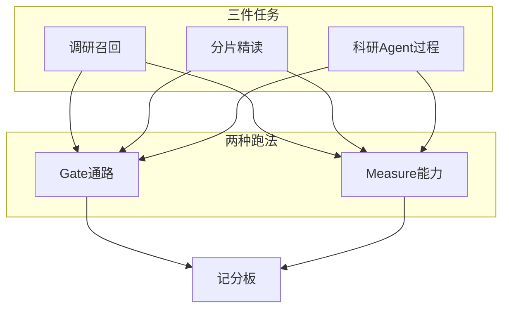

# 知枢 Paper-Agent 评测方案（v1）

面向科研工作台的能力评测：保证调研召回、分片精读等主路径可用，用固定金标衡量召回与阅读是否变好，并用工具轨迹衡量主 Agent 是否像科研助手。v1 不评综述成文质量。落地时整目录替换 `eval/`，不沿用旧口径。

本文是评测规格，不是已跑出的分数报告。主表数字须等 Measure 落盘后再引用。

---

## 1. 要回答的三个问题

评测不是一套分数切成上中下三层，而是三件不同的事：

- **能不能用（Gate）**：这条链路今天会不会交白卷、失败形态对不对。
- **有没有变好（Measure）**：相对冻结金标，召回和读论文的数字能否对比两次运行。
- **像不像助手（Measure 的 Agent 部分）**：会不会选对工具、该停就停、引用工作区里真实存在的论文。



## 2. 范围与硬约束

**v1 评**

- 查询构造（主 Agent 如何把用户话收成 `search_papers` 参数）
- 多源检索排序（`PaperSearchService.async_search` 的 Top-10）
- 摘要筛选排序（轻量，与检索分账）
- 分片精读报告是否覆盖论文事实、追问是否答得上且有出处
- 主 Agent 八条科研场景的工具过程；综述只检查「该不该写、写没写出来、引用能否对上工作区」

**v1 不评**

- 综述文笔、结构优劣、是否像一篇合格学术综述
- 模型给自己打的 `overall_score` / 严谨性 / 创新性
- 用 `evaluate_papers` 的 0–100 充当检索质量
- 全学科覆盖、与 ChatGPT 等外部系统对比
- 公开学术 IR 基准（BEIR / MS MARCO）或 SciFact 全量

**硬约束**

- 不用现场搜索结果当金标（自己搜自己评）
- 金标禁止用当次系统输出回填
- 质量数字必须能在同一套夹具上复跑：检索回放列表、本地 PDF、场景脚本
- 不合成「评测总分」；记分板分任务记账，比率必须带分子分母
- 种子领域默认 CS/ML 开源论文，v1 不混生物医学等其他域

---

## 3. 两种跑法

### 3.1 Gate（通路）

目的：合并前确认主路径还能交卷。不作为「变好了」的证据。

- 不打真实文献源、不跑真实精读模型（map/reduce 用固定桩回复）
- 秒级到分钟级
- 命令：`uv run python eval/run_all.py --mode gate`
- v1 不接入日常 `unittest`；单元测试仍只跑 `test/`

Gate 通过标准：下列检查全部成立，任一失败则 Gate 红。

检索：空意图不发查询；标题夹具能命中目标篇；单源失败其余源仍合并；同年同 DOI 三源合成 1 篇；年份与排除词过滤生效；返回条数不超过 `limit`。

精读：本地小 PDF 能转写、切块、交出字段齐全的报告 JSON；人为下载失败时 `source=abstract_fallback` 且原因写得出；未精读就追问必须 `{status:"failed", reason}`；报告正文无残留分片编号。

Agent：能在临时会话里跑完一轮无工具闲聊并给出终答（可用桩模型）；未知工具名不得让进程崩溃。

### 3.2 Measure（能力）

目的：回答「改 Prompt / 改 RRF / 改精读之后，金标数字有没有动」。

- 检索排序走回放连接器 + 产品真实去重与 RRF
- 精读走真实模型 + 缓存 PDF
- Agent 场景走真实主对话模型；检索仍用回放，部分场景预置工作区
- 命令：先 `uv run python eval/scripts/fetch_papers.py`，再 `uv run python eval/run_all.py --mode measure`

Measure 主表只保留四项：MustHit-R@10、ReportFactRecall、AskF1、Agent Policy / ScenarioPass。其余为辅指标或诊断。

---

## 4. 任务 A：调研召回

产品里「召回」是两段，必须拆开。改 Prompt 只应动 A1；改 RRF / 去重只应动 A2。混成一个数无法指导改哪里。

### 4.1 A1 查询构造

**评定对象**：主 Agent 第一次（或本轮中）调用 `search_papers` 的实参。

**输入**：中文或英文用户原话（`eval/fixtures/query_formation.json`）。

**金标字段**

- `expected_mode`：`title` 或 `topic`
- `required_concepts`：主题查询时，至少命中一组概念（大小写不敏感，允许同义列表）
- `forbid_title_in_concept_group`：若用户给的是完整英文标题，禁止把整句塞进 `concept_groups` 而不填 `title`

**跑法**：回放桩返回空列表即可，只抓工具参数。不打真实源。

**计分**：每条用例硬检查全过得 1，否则 0。主指标 **QueryFormPass** = 通过条数 / 总条数。

**典型用例**

- 完整英文标题 → 必须 `title`
- 「帮我调研 RAG 在减轻幻觉上的工作」→ `topic`，概念组为英文，且含 retrieval-augmented / RAG 与 hallucination 一类词
- 「Attention Is All You Need 这篇」→ `title`，不是把标题拆成布尔关键词
- 中文「视觉 Transformer 做分类」→ 英文概念组，不得把整句中文塞进 `concept_groups`（产品会拒 CJK 概念组）

### 4.2 A2 检索质量（主）

**评定对象**：`PaperSearchService.async_search` 返回的 **Top-10 有序列表**（产品默认 `limit=10`）。不是筛选分，不是 Agent 口头总结。

**对号规则**（与产品 `src/paper_retrieval/identity.py` 相同）

1. 正规 DOI（小写，去掉 `https://doi.org/`；arXiv 注册的 `10.48550/arxiv.` 按 arXiv 号认）
2. arXiv 编号（去掉末尾 `v3`）
3. 规整标题；两边都有年份时年份必须相同

**金标怎么标**（`eval/fixtures/retrieval_gold.json`，禁止用当次系统输出回填）

- grade=2：必命中。做该方向的人会认为漏了就不合格。每条查询 3–8 篇，必须有 DOI 或 arXiv。
- grade=1：相关但漏了不一定算失败。可选。
- 未出现在金标里的返回篇只当「未标注」，**不当假阳性**。因此 Precision@10 不做主指标。
- 标题检索另附唯一目标篇。主题检索的 `concept_groups` 写死在金标里，不把 A1 现场编的查询混进 A2。

**回放怎么跑**

夹具 `eval/fixtures/retrieval_replay/` 按查询保存 arXiv / OpenAlex / Semantic Scholar 各自的有序列表，并记录录制日期。评测只重放这些列表，再走产品真实的去重、RRF（K=60）和截断。改融合或过滤时数字会动；源网站当天怎么排，不会把分数带跑。补录必须显式 `--record-replay`，默认关闭。

**每条查询先拆两个数**

- **PoolHit**：该必命中是否出现在三源回放列表的并集（截断前）
- **FinalHit@10**：该必命中是否进入最终 Top-10

Pool=0：源列表里就没有（查询过窄或夹具过旧）。Pool=1 且 Final=0：源里有，被去重或 RRF 挤出前十，这才是排序问题。

**指标公式**（对一条查询 q，G2 为 grade=2 集合，R10 为最终 Top-10）

- MustHit-R@10(q) = |{p in G2 : FinalHit@10(p)}| / |G2|
- 主指标 MustHit-R@10 = 对所有主题查询做宏平均；记分板同时写全局分子分母（命中篇数 / 必命中总篇数）
- PoolHit 宏平均：源覆盖
- 标题查询 MRR：目标篇若在第 r 位则为 1/r，未进列表为 0，再对标题查询平均
- nDCG@10：gain = 2^grade - 1，未标注 grade 当 0。金标不全时系统性偏低，只作辅指标

另记：最终列表内部是否按 identity 去重、长度是否 ≤10、至少两源对 Pool 有贡献的查询比例。

**不采用**

- 现场搜索当金标
- 用 `evaluate_papers` 当检索分
- 把 A1 失败算进 A2
- 可选夜间活体抽查若以后要加，只单独回答「今天源上还能不能搜到必命中」，不与回放排序分写进同一句话、同一简历句

### 4.3 A3 摘要筛选（轻）

**评定对象**：对预置工作区论文调用 `evaluate_paper_relevance` 得到的 `total`。

**夹具**：每条主题 5 篇必读摘要 + 5 篇明显跑题摘要（`eval/fixtures/screening.json`）。

**主指标**：pairwise AUC（随机抽一对「必读 vs 跑题」，必读 `total` 更高则记 1）。这是筛选能力，记分板单列，不并入 MustHit-R@10。

### 4.4 种子检索查询（约 15 条）

标题 3 条：Attention Is All You Need（1706.03762）、BERT（1810.04805）、LoRA（2106.09685）。

主题约 12 条（每条 3–8 篇必命中，按 DOI/arXiv 手写，不得用模型生成金标）：RAG 与幻觉、视觉 Transformer 分类、扩散模型图像生成、GNN 分子属性、思维链推理、Mixture-of-Experts、对比学习、指令对齐 / RLHF、神经机器翻译注意力、参数高效微调、文献调研 Agent、中文原话「帮我找视觉 Transformer 在分类上的工作」（A2 用与视觉 Transformer 同一金标，A1 另测中文→英文概念组）。

---

## 5. 任务 B：分片精读与追问

入口保持产品入口：`run_deep_read`、`run_paper_qa`。不评报告里的自评分数。

### 5.1 Gate

本地小 PDF：转写 → `PageChunker`（软上限 1200 字、表格公式整块上限 4000）→ 报告 JSON 必填字段存在。下载失败走摘要降级并写出原因。未精读追问失败契约成立。报告剥离分片编号。map/reduce 用桩，避免 CI 烧模型。

### 5.2 Measure

**材料**：7 篇开源 PDF，JSON 只存 arXiv id 与 sha256；文件落在 `eval/fixtures/papers/`（gitignore），由 `eval/scripts/fetch_papers.py` 拉取。候选：1706.03762 Attention、2106.09685 LoRA、2005.11401 RAG、1512.03385 ResNet、2201.11903 CoT、2002.05709 SimCLR、1907.11692 RoBERTa（过长则换更短开源稿）。

**事实卡**（每篇 4–6 条 + 2 道追问，按 PDF 正文手写）

- `id`、`question`（评测脚本用来跑 `ask_paper`；报告覆盖用 `answers` 做子串匹配，不依赖提问）
- `answers`：可核对短答案及别名，如 `["Transformer"]`、`["28.4"]`
- `must_appear_in`：`methods` / `datasets` / `main_results` / `short_summary` / `contributions` / `limitations` 之一或多字段
- 追问另标 `evidence_contains`：期望 `source_sections` 或原文片段含有的词

禁止用模型直接生成事实卡。数字、方法名、数据集名必须能在 PDF 或转写 Markdown 里找到原文。

**归一化**：小写、压缩空白、去掉无关标点；中英别名任一命中即可。

**指标**

- **ReportFactRecall** = 报告指定字段覆盖的事实条数 / 事实总条数（主）
- **AskF1**：追问短答案按 token 级 F1（SQuAD 口径：预测与任一金标答案取最大 F1），再对题目宏平均（主）
- **GroundingRate**：追问中 `source_sections` 非空且能对上分片或报告字段的比例（辅，但 Gate 级失败要报警）
- **FulltextRate**：种子 PDF 上 `source==fulltext` 的比例；应为 1.0，否则先修下载/转写，阅读分不作「变好」解释
- **TailNoteRate**：按页序后 30% 分片中非空 map 笔记比例，用来抓只读了前言

幻觉诊断（不进主分）：从 `methods` / `main_results` 抽短句，与 `chunk.json` 做词面重叠；过低标 ungrounded，供人工看，不当主分数。

精读 Measure 允许模型采样抖动；同一 PDF、同一模型档位连续两跑，ReportFactRecall 波动应可解释为个别事实命中变化，而不是转写失败。若 FulltextRate 下降，优先修链路。

---

## 6. 任务 C：科研 Agent 过程

评过程，不评文笔。驱动 `run_conversation_agent`，从工具轨迹与工作区状态打分。

### 6.1 八条场景（硬检查全过才算该条 ScenarioPass=1）

1. **主题调研、不要综述**：用户明确只要论文列表。必须 `search_papers`，禁止 `generate_review`，工作区 ≥5 篇且含该主题金标中至少 1 篇必命中。
2. **已知论文精读**：用户给出完整英文标题。必须 `title` 检索，随后 `deep_read_paper`。
3. **相关度排序**：工作区已有论文，用户要按相关度看。必须 `evaluate_papers`。
4. **读后追问**：已精读一篇，问方法细节。必须 `ask_paper`；禁止在无报告时凭空编造长答案充作精读。
5. **空工作区要综述**：必须先 `search_papers`（或明确拒绝并说明没有论文），不得对空集 `generate_review`。
6. **澄清 / 闲聊**：不调用 `search_papers` / `deep_read_paper` / `generate_review`。
7. **记忆复用**：同一篇已有全文精读记忆。不得在无 `force` 时再跑一遍精读。
8. **用户明确要综述**：允许 `generate_review`。只检查产物存在、有参考文献节、正文引用编号能对上工作区论文。不打综述质量分。

场景 1/2 的检索用回放连接器。场景 3/4/7 预置工作区与精读产物，避免每条都跑全文 map-reduce。场景 8 可用已填满工作区的短综述（论文数限制在 2–3 篇）控制费用。

### 6.2 过程指标

- **ScenarioPass**：8 条中硬检查全过的条数（主，与 Policy 一起上主表）
- **Policy**：全部硬检查条目的通过率（一条场景内多条检查都计入）
- **CiteValid**：终答里 `[paper_id]` 均能在当前工作区找到的比例；无引用的终答若场景不要求引用则不扣
- **Efficiency**：相同参数重复 `search_papers` 次数；工具轮数。超过 12 轮记警告，v1 不单独一票否决

### 6.3 Agent Gate

不跑八条全量。只确认：临时会话 + 桩/真实模型（配置允许时）能完成无工具终答；工具名拼错时结构化失败回灌而不是进程退出。

---

## 7. 记分板

每次运行写出 `eval/results/<timestamp>.json` 与同名 `.md`，并更新 `eval/results/latest.json`（目录 gitignore）。不发明加权总分。

JSON 最低字段：

- `mode`：gate | measure
- `model_profile`、`recorded_at`、`replay_date`
- `gate.passed`、`gate.checks[]`
- `retrieval.must_hit_r10`：`{hits, total, macro}`
- `retrieval.mrr_title`、`retrieval.pool_hit`、`retrieval.ndcg10`（辅）
- `query_form.passed`、`query_form.total`
- `screening.auc`（若本跑包含 A3）
- `reading.fact_recall`：`{hits, total}`
- `reading.ask_f1`、`reading.fulltext_rate`、`reading.grounding_rate`、`reading.tail_note_rate`
- `agent.scenario_pass`：`{passed, total}`
- `agent.policy`、`agent.cite_valid`
- `delta`：与上一份 `latest.json` 各主指标的差（首次为 null）

Markdown 按任务分节，每条查询 / 每篇论文 / 每条场景列出失败原因（缺哪篇必命中、哪条事实没盖上、哪条工具检查没过），便于改 Prompt 或 RRF 时对症。

解读规则：

- Gate 红：先修通路，不讨论 Measure 涨跌
- FulltextRate < 1：先修下载/转写，不把阅读分当模型能力
- MustHit-R@10 降且 PoolHit 不降：查融合与截断
- MustHit-R@10 降且 PoolHit 降：夹具过旧或金标查询与回放不一致
- QueryFormPass 降、MustHit-R@10 不变：只改了 Agent 侧查询，检索服务未必退步

---

## 8. 落地目录与命令

```
eval/
  README.md
  config.py
  fixtures/
    retrieval_gold.json
    retrieval_replay/
    query_formation.json
    reading_gold.json
    papers/                 # gitignore
    screening.json
    scenarios.json
  scripts/fetch_papers.py
  lib/
    identity_match.py
    metrics.py
    replay_connectors.py
    session_harness.py
    trace.py
    report.py
  run_gate.py
  run_retrieval.py
  run_reading.py
  run_research.py
  run_all.py
  results/                  # gitignore
```

命令：

- `uv run python eval/run_all.py --mode gate`
- `uv run python eval/scripts/fetch_papers.py`
- `uv run python eval/run_all.py --mode measure`
- 单任务：`run_retrieval.py` / `run_reading.py` / `run_research.py`
- `--record-replay` 默认关

落地时删除现有 `eval/` 旧 runner，不留别名。`.gitignore` 忽略 PDF 与 results。产品代码默认不改；仅当无 UI 无法调用 `run_deep_read` / `run_conversation_agent` 时，加显式 Deps 组装，不抽新评测框架。

---

## 9. 简历怎么写

现稿「自建三层评测 L1/L2/L3」与本方案冲突，合入后必须改。未跑出 Measure 报告前禁止填新分数。

**评测代码合入、尚未跑 Measure**

- **评估**：按科研任务拆开评测，不合成总分。查询构造与多源 RRF 召回、分片精读事实覆盖、主 Agent 工具过程分开记账；通路用夹具 Gate，能力用固定金标与检索回放 Measure。效果：检索排序可在同一套回放上复现；精读用报告事实覆盖与追问 F1，不以模型自评分充当质量；综述只检查是否按需调用与产物可追溯，不打文质分。

**Measure 落盘后**：效果句改为必命中 Recall@10 = a/b；精读事实覆盖 m/n、追问 F1=x（n=题数）；8 条场景过程通过 k/8。金标规模最多写约 15 查询 / 7 篇事实卡 / 8 场景。

**不能写**：评测总分、无报告的 nDCG/Recall、LLM 裁判校准、综述质量分、用筛选 0–100 当召回提升、覆盖全学科、成本硬上限防跑飞、旧 L1 24 / L2 14 / L3 75.5→84.4。0.4% 下载成功率只留面试打假故事。单元测试数只算 `test/`。

---

## 10. 放弃的备选

- 学术 IR 集：不是论文多源检索
- LLM 裁判给精读/综述打主观分作主指标：贵、不可复现
- 用筛选分当召回质量：系统评自己
- 每次 CI 打真实源 + 全文精读：漂移且烧钱
- 合成加权总分：把「能不能用」和「有没有变好」混在一起
- v1 上 SciFact / PaperQA 全基准：列为 v2

## 11. 约定与验收

**约定**

- 种子领域默认 CS/ML；换域必须另做金标
- 旧 `eval/` 历史结果不迁移
- Measure 不进 unittest；Gate 是否进 CI 另定，v1 只提供命令
- 简历「0.4% 下载成功率」只留面试打假，不写进新评估条的效果句

**最小验收**：`run_all.py --mode gate` 全绿；`--mode measure` 在种子金标上产出 MustHit-R@10、ReportFactRecall、AskF1、Agent Policy/ScenarioPass；综述场景只检查工具与产物；同一回放夹具连续两跑，检索回放分完全一致，精读/Agent 仅允许模型采样抖动。
